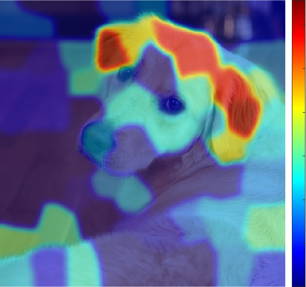
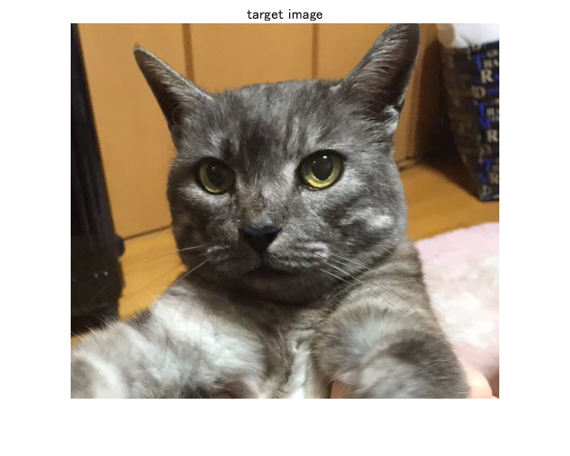
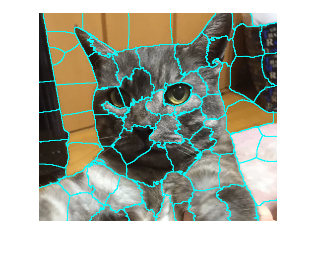
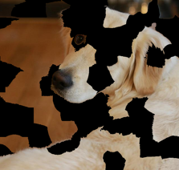
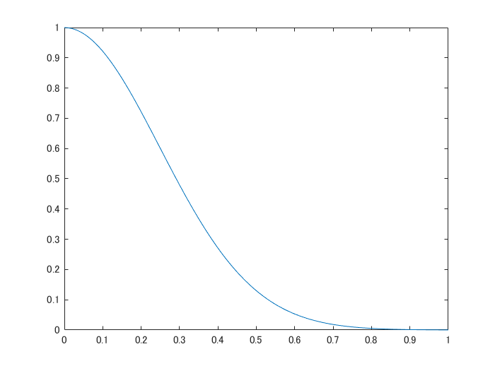
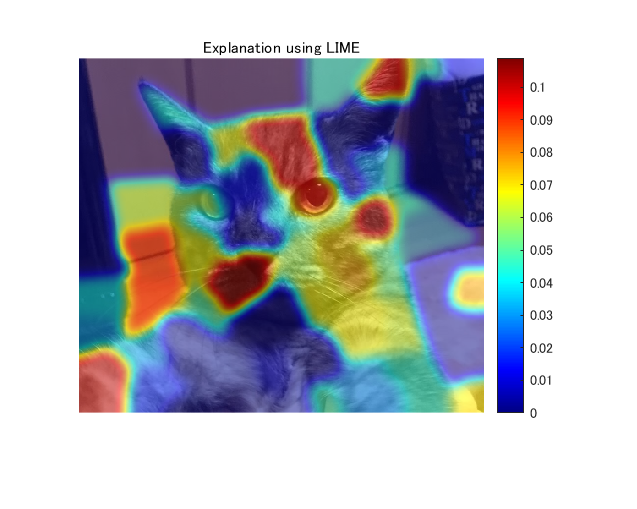

[](https://jp.mathworks.com/matlabcentral/fileexchange/77828-explainable-ai-interpreting-the-classification-using-lime)
# Explainable AI: interpreting the classification performed by deep learning with LIME

**[English]**  
This demo shows how to interpret the classification by CNN using LIME (Local Interpretable Model-agnostic Explanations) [1]. This demo was created based on [1], but the implementation might be a little bit different from its official one. This code highlights the regions that contributed to the classification.  It helps you interpret and improve the model, or you can recoginize the classifier is not untrustworthy for you if the region highlighted is irrelevant for the true class. 


  
**[Japanese]**  
LIME [1]と呼ばれる手法を用いて、深層学習による画像分類を行った際の重要箇所を可視化します。公式の実装とは若干の違いがあるかもしれませんのでご注意ください。  
サムネイルでは、学習済みネットワーク（ResNet-18 [2]）が、ゴールデンレトリバーと予測したときの判断根拠の位置を可視化しています。  
この内容は、[こちらのブログ（日本語）](https://kentapt.hatenablog.com/entry/2021/12/06/224424?_ga=2.30839223.969068872.1638721409-1601353361.1630730568)にも掲載されています。ぜひご覧ください。

**[Key words]**  
classification, cnn (convolutional neural network), deep learning, explainable AI, image, interpret, LIME (Local Interpretable Model-agnostic Explanations), machine learning, superpixel, visualization, why

**[Reference]**  
[1] Ribeiro, M.T., Singh, S. and Guestrin, C., 2016, August. " Why should I trust you?" Explaining the predictions of any classifier. In *Proceedings of the 22nd ACM SIGKDD international conference on knowledge discovery and data mining* (pp. 1135-1144).


[2] He, K., Zhang, X., Ren, S. and Sun, J., 2016. Deep residual learning for image recognition. In *Proceedings of the IEEE conference on computer vision and pattern recognition* (pp. 770-778).





# Load the image

```matlab:Code
clear;clc;close all
% read the target image
I=imread('img.png');
figure;imshow(I);title('target image')
```





Importing pre-trained network, ResNet-18


```matlab:Code
net=resnet18;
```


Classify the image and confirm if the result is correct. 


```matlab:Code
Ypred=classify(net,imresize(I,[224 224]))
```


```text:Output
Ypred = 
     Egyptian cat 

```


Extract the index corresponding to the classification result. 


```matlab:Code
classIdx=find(net.Layers(71, 1).Classes==Ypred);
```

# Create superpixels 


First, the target image is divided into superpixels. Note that the final result is dependent on this segmentation. We have to determine proper parameters for this. 


Calculate superpixels of the image. 


```matlab:Code
numSuperPixel=75;
[L,N] = superpixels(I,numSuperPixel);
```


For the detail of the superpixel generation, please type as follows and confirm the algorithm. 


```matlab:Code
% doc superpixels
```


Display the superpixel boundaries overlaid on the original image.


```matlab:Code
figure
BW = boundarymask(L);
imshow(imoverlay(I,BW,'cyan'),'InitialMagnification',100)
```




# Sampling for Local Exploration


This section creates pertubated image as shown below. Each superpixel was assigned 0 or 1 where the superpixel with 1 is displayed and otherwise colored by black.  





```matlab:Code
% the number of the process to make perturbated images
% higher number of sampleNum leads to more reliable result with higher
% computation cost
sampleNum=1000;
% calculate similarity with the original image
similarity=zeros(sampleNum,1);
indices=zeros(sampleNum,N);
img=zeros(224,224,3,sampleNum);
for i=1:sampleNum
    % randomly black-out the superpixels
    ind=rand(N,1)>rand(1)*.8;
    map=zeros(size(I,1:2));
    for j=[find(ind==1)]'
        ROI=L==j;
        map=ROI+map;
    end  
    img(:,:,:,i)=imresize(I.*uint8(map),[224 224]);
    % calculate the similarity
    % other metrics for calculating similarity are also fine
    % this calculation also affetcts to the result
    similarity(i)=1-nnz(ind)./numSuperPixel;
    indices(i,:)=ind;   
end
```

# Predict the perturbated images using CNN model to interpret


Use `activations` function to explore the classification score for cat. 


```matlab:Code
prob=activations(net,uint8(img),'prob','OutputAs','rows');
score=prob(:,classIdx);
```

# Fitting using weighted linear model


Use fitrlinear function to perform weighted linear fitting. Specify the weight like 'Weights',similarity. The input indices represents 1 or 0. For example, if the value of the variable "indices" is [1 0 1] , the first and third superpixels are active and second superpixel is masked by black. The label to predict is the score with each perturbated image. Note that this similarity was calculated using Kernel function in the original paper. 


```matlab:Code
sigma=.35;
weights=exp(-similarity.^2/(sigma.^2));
mdl=fitrlinear(indices,score,'Learner','leastsquares','Weights',weights);
```


Confirm the exponential kernel used for the weighting. 


```matlab:Code
x=[0:0.01:1];
y=(exp(-x.^2/(sigma.^2)));
figure;plot(x,y)
```




# Displaying the result


This result is just an example of LIME-based approach. This result can be changed with different parameter settings such as in superpixel generation, fitting method (I used linear fitting model) and parameters for fitting. 


```matlab:Code
result=zeros(size(L));
for i=1:N
    ROI=L==i;
    result=result+ROI.*max(mdl.Beta(i),0);% calculate the contribution if the weight is non-zero
end

% smoothing the LIME result. this is not included in the official
% implementation
result2=imgaussfilt(result,8);
% display the final result
figure;imshow(I);hold on
imagesc(result2,'AlphaData',0.5);
colormap jet;colorbar;hold off;
title("Explanation using LIME");
```




