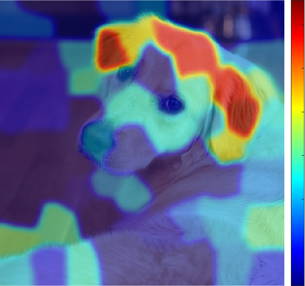
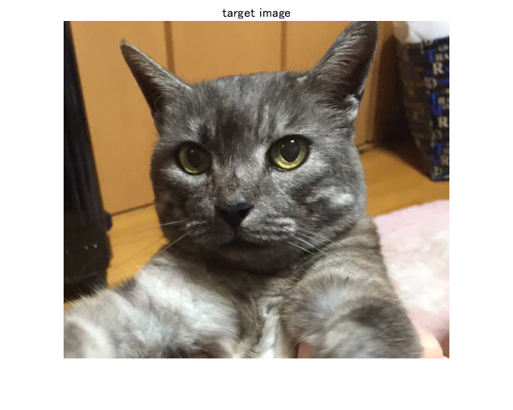
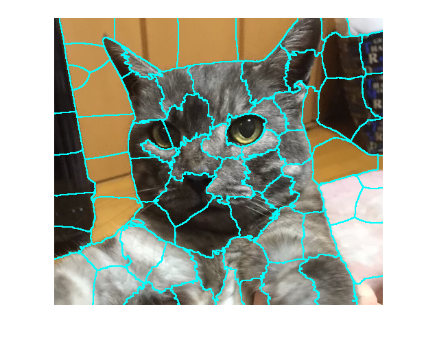
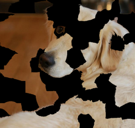
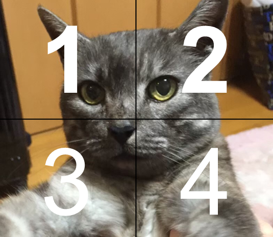
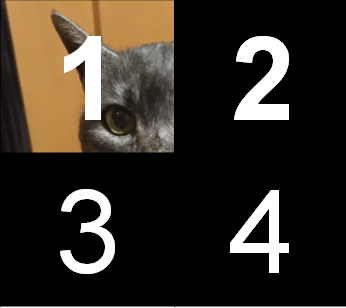
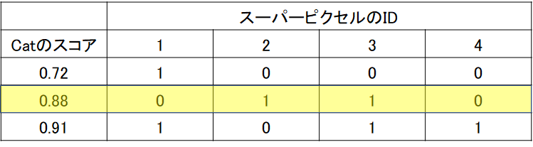
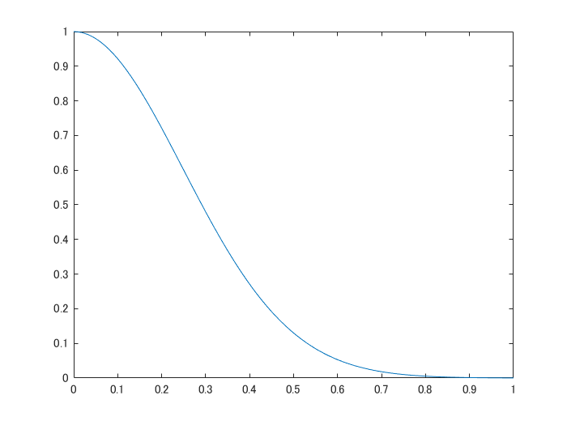
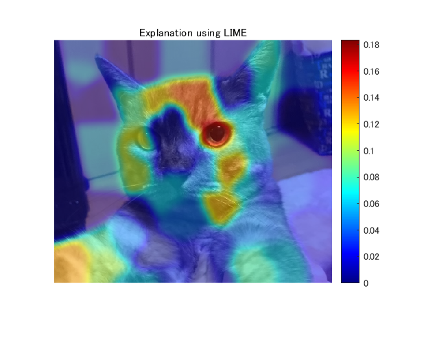
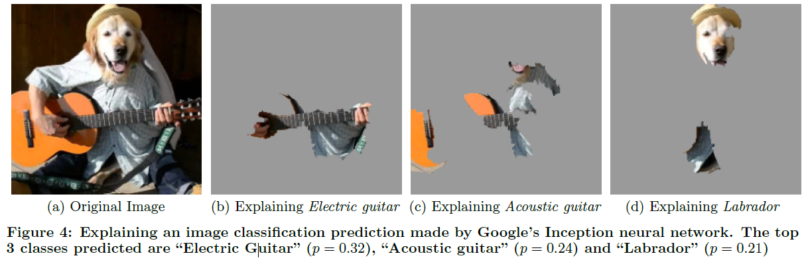

# Explainable AI:LIMEを用いた判断根拠の可視化

こちらの記事は、**MATLAB/Simulink Advent Calendar 2021**の8日目の記事として書かれたものです。

https://qiita.com/advent-calendar/2021/matlab

# はじめに

この記事では、LIMEとよばれる手法を用いて、畳み込みニューラルネットワーク（CNN）によって画像分類を行ったときの判断根拠の可視化（どのような部分を見て、その分類結果に至ったのか）を行います。画像に対して適用するときの仕組みをここでは説明したいと思います。この画像をもととなる論文はこちらになります： [LIME (Local Interpretable Model-agnostic Explanations)](https://dl.acm.org/doi/abs/10.1145/2939672.2939778) 。 また、[こちら](https://arxiv.org/abs/1602.04938)からも入手することができます。これをMATLAB実装した2020年夏ごろは、公開されている唯一のMATLAB実装だった（と思う）のですが、2020年秋バージョンから`imageLime`という関数が、MATLABで公式実装され、１行で実行できるようになりました。ご自身の研究などで使う際は、[こちらの公式の実装](https://jp.mathworks.com/help/deeplearning/ref/imagelime.html)を使い、そして、その内容を確認したい場合には以下のリポジトリを利用すると良いかもしれません。

（注意）こちらの記事は、チェックはしておりますが、理解違いやミスがあるかもしれません。予めご了承ください。

この記事のコードやデータはこちらのページからダウンロードすることができます

https://github.com/KentaItakura/Explainable-AI-interpreting-the-classification-performed-by-deep-learning-with-LIME-using-MATLAB

# LIMEについて

例えば、下の犬の画像を例とすると、CNNによって犬であると分類した際に、どのような箇所に注目してこの分類結果に至ったかということを示しています。赤っぽい色の方が影響が強いことを示しています。LIMEは、画像データだけでなく、表形式のデータなど、ほかのデータ形式に関しても利用可能です。ここでは、画像データを対象として、実装していきます。



# LIMEについて：もととなる論文のイントロダクションの和訳

こちらの手法については、もととなっているRibeiroら (2016)の論文のイントロダクションの部分を読むのが良いと思います。以下に、和訳を掲載します。一部、筆者の解釈による意訳を含みます。

========================================================

機械学習は、近年の科学技術の進歩の中核をなすものであるが、この分野では人間の役割の重要性が見落とされがちである。人間が機械学習の分類器をツールとして直接使用する場合でも、ある製品にモデルを導入する場合でも、信頼性という重要な問題が残っている。信頼の定義として、2つの異なる（しかし関連する）定義について、区別して考えることが重要である。(1) 予測の信頼、すなわちユーザーが個々の予測を十分に信頼し、それに基づいて何らかの行動を取るかどうか、(2) モデルの信頼、すなわちユーザーがモデルを実装した場合に、「そのモデルが合理的な道筋をもって行動する」、と信頼するかどうか、である。どちらにおいても、そのモデルを信頼するかどうかは、ユーザー（人）がそのモデルをブラックボックスとして見るのではなく、人間がモデルの動作をどれだけ理解しているかに直接影響される。モデルが何らかの意思決定に使用される場合、個々の予測に対する信頼性について判断することは重要である。例えば、機械学習を医療診断[6]やテロの検知に使用する場合、十分な根拠なしに機械学習モデルを信頼すると、重大な過失を招く恐れがある。個々の予測を信頼することとは別に、モデルを実世界に実装し役立てようとする前に、その機械学習モデルそのものを評価する必要がある。この判断を下すためには、そのモデルが実世界のデータ上で、ただしい評価基準に従って良好な結果を示すものであると、ユーザーが確信する必要があります。現在、そのようなモデルの評価は、利用可能な検証データセットを用いて予測し、いくつかの評価指標を用いて行われています。しかし、実世界のデータはそれらの利用可能なデータセットとは大きく異なることが多く、またさらに、その評価指標が製品の目標を適切に反映しない場合もあります。このような評価指標を最適なものにすることに加えて、個々のデータに対する、その予測値とその判断基準を精査することは、それらの問題の解決策となりえる。この場合、特に大規模なデータセットでは、どのデータを検査すべきかを提案し、ユーザーを支援することが重要である。本論文では、予測の信頼性の問題に対する解決策として、個々の予測に対する説明性を提供する方法を提案し、さらに、モデル自体の信頼性の問題に対する解決策として、そのようにデータセットを予測（および説明）したときの、重要なデータを選択可能にする方法を提案する。我々の主な貢献は以下のようにまとめられる。

   -  LIME、解釈可能なモデルで対象とする機械学習モデルを局所的に近似することで、任意の分類モデルや回帰モデルの予測の根拠を忠実に説明することができるアルゴリズム。 
   -  SP-LIMEは、モデルの信頼性の問題に対処するために、説明性を持つ、いくつかの代表的なインスタンス（データ）を、劣モジュラ最適化によって選択する手法である。 
   -  シミュレーションおよび人間による、総合的な評価で、その説明がモデルの信頼性にどのような影響を及ぼすか検証する。我々の実験では、LIMEを使用した非専門家に、どちらの分類器が実世界でよりよく汎用的に有効利用できるかを選んでもらう。さらに、LIMEを使って特徴量の調整を行うことで、20のニュースグループで訓練された信頼性の低いモデルを大幅に改良することができた。また、画像を対象としたニューラルネットワークの予測を理解することで、その分類モデルを信用すべきでない場合やその理由を実務者が知ることができる、ということを示した。 

========================================================

確かに、手元のデータセットでは高い精度が出ても、それの判断根拠がわからないと、その信頼性を検証するのは難しいですし、そのモデルをよりよいものに改良する際にもどのようなデータを加えたらよいかなどは判断が難しいですね。

# 大まかな流れ

今回は、**大まかな流れを説明することに重きを置いているので、ほかの言語を使ってる方や、プログラミングは行わない方も見ていただけますと幸いです。**

step1: 画像のロード

step2: 学習済み深層学習ネットワークのインポートstep3: スーパーピクセルの作成

step3: スーパーピクセルの作成

step4: ランダムにスーパーピクセルの情報をゼロし、もとの画像との距離を計算する

step5: CNNにてテスト画像を推論し、猫の確率を取り出す

step6: 線形モデルでフィッティングを行う

step7:結果の可視化

# 具体例をもとにLIMEを説明
## step1: 画像のロード

今回は、この猫の画像を用いて、分類とその判断根拠の可視化を行います。

```matlab:Code
I=imread('img.png'); %画像の読み込み
figure;imshow(I);title('target image') % 表示
```



## step2: 学習済み深層学習ネットワークのインポート

ここでは、ImageNetという大規模な画像のデータセットであらかじめ訓練し、高い分類性を持つネットワークをインポートします。もちろん、自分で訓練したモデルでも適用可能です。Heら (2016)のResNetをここでは使います。

```matlab:Code
net=resnet18; % Importing pre-trained network, ResNet-18
```

分類を行って、catという分類結果になっていることを確認します。

```matlab:Code
Ypred=classify(net,imresize(I,[224 224])) % Classify the image and confirm if the result is correct. 
```

```text:Output
Ypred = 
     Egyptian cat 

```

ImageNetは1000クラスのカテゴリで訓練されていて、いまのEgyptian catのインデックス（カテゴリ番号のようなもの）を取り出します。

```matlab:Code
classIdx=find(net.Layers(71, 1).Classes==Ypred); % Extract the index corresponding to the classification result. 
```

## step3: スーパーピクセルの作成

画像のピクセルをスーパーピクセルと呼ばれる、類似した色情報を持つピクセルのまとまりに変換します。スーパーピクセルへの変換方法やそのパラメータは多く存在しますが、いまはデフォルトの設定で行っていきます。デフォルトではSimple Linear Iterative Clustering (SLIC) アルゴリズムを用います。パラメータとしては、例えば、いくつのスーパーピクセルに分解するか、などが含まれます。

```matlab:Code
numSuperPixel=75; % スーパーピクセルの数を75として設定
[L,N] = superpixels(I,numSuperPixel); % スーパーピクセルの計算
```

スーパーピクセルの境界を色付けし、スーパーピクセルを可視化します。

```matlab:Code
BW = boundarymask(L);
figure;imshow(imoverlay(I,BW,'cyan'),'InitialMagnification',100)
```



このように、画像がそれぞれのまとまりに分解されました。

## step4: ランダムにスーパーピクセルの情報をゼロし、もとの画像との距離を計算する

以下に示されるように、pertubated imageと呼ばれる、画像の一部の情報を欠損させたものを作成します。スーパーピクセルが75個あるとすると、ランダムに黒に変換します。この例ではランダムに約20%の確率で黒に変換しています。また、同時に、distance_ImPair（距離）を計算していて、それはもとの画像と黒に変換した下の犬の画像がどれだけ変化しているかを計算します。この例では、黒以外のピクセルの数ともとの画像の画像数の比で距離を計算しています。コサイン類似度などで計算するのがより良いと思います。



作成するPertubated imageの数を設定します。多くの枚数を生成した方が信頼度は高まりますが、それと同時に計算時間が長くなります。

```matlab:Code
sampleNum=1000; 
% calculate similarity with the original image
distance_ImPair=zeros(sampleNum,1);
indices=zeros(sampleNum,N);
img=zeros(224,224,3,sampleNum);
for i=1:sampleNum
    % randomly black-out the superpixels
    ind=rand(N,1)>0.2;
    map=zeros(size(I,1:2));
    for j=[find(ind==1)]'
        ROI=L==j;
        map=ROI+map;
    end  
    img(:,:,:,i)=imresize(I.*uint8(map),[224 224]);
    % calculate the similarity
    % other metrics for calculating similarity are also fine
    % this calculation also affetcts to the result
    distance_ImPair(i)=1-nnz(ind)./N; % 距離の計算。ゼロが黒でマスクをされているところ。
    % つまり、2つ目の項はゼロでない（元の状態で残っている）件数の割合。1-nnz(ind)/Nは、同じ画像の場合、0になる
    indices(i,:)=ind;   
end
```

# step5: CNNにてテスト画像を推論し、猫の確率を取り出す

MATLABでは、 `activations`関数を用いて、特定の層までの推論を行うことができます。

さきほどの部分的に黒で塗りつぶされた箇所に対してCNNで推論を行います。ここでのアイデアとしては、

•それぞれの加工された画像に対して猫のクラスのスコアを確認するが、場合によってはそのスコア（猫である確率）が大きく下がる場合とそうでないときがあるはず

•正解のスコアが下がる→CNNにとって重要な場所が隠された、と考えます

```matlab:Code
prob=activations(net,uint8(img),'prob','OutputAs','rows');
score=prob(:,classIdx);
```

# step6: 線形モデルでフィッティングを行う

下の4つに区切られた画像は、入力画像を非常に粗く4分割した場合であると考えます。それぞれの箇所を１～４と命名しています。先述したように、この分割の数もユーザーの決めるパラメータになります。



そして、以下のように、1だけが保持されて、2\textasciitilde{}4はすべて黒で隠されてしまったとします。



ここでは、1枚だけではなく、複数のpertubated imageが生成されますが、以下の3つのサンプルが生成されたとします。下の表の見方としては、スーパーピクセルのIDというのが上の1\textasciitilde{}4の各領域を表し、1か0かというのは、その領域が残っているかということを示します。例えば、一番上の段は、１だけ残った画像を意味していて、ちょうど上の画像に対応しています。同様に、2段目のサンプルに関しては、2と3のみが保持されて、1と4の領域は黒で隠されてしまったとします。「Catのスコア」に関してですが、ここはその一部の画像部分が隠された状態で、CNNで推論をしたときのCatの確率を示します。通常のCNNでは、学習したカテゴリの中で（例：1000クラス）、最も高いスコアを持つクラスを推論の結果としますが、ここでは、一部の領域が隠れているのでもしかしたら、推論結果は猫ではなくなってしまうかもしれません。しかし、ここでは、猫のスコアが、マスクで隠されたあと/前でどう変わるかということに注目するため、猫のスコアを見る必要があります。



ここで、（猫のスコア）＝a1×（スーパーピクセルの1の箇所が残っているか）+ a2×（スーパーピクセルの2の箇所が残っているか）...+ a4×（スーパーピクセルの4の箇所が残っているか）というような要領でフィッティングを行います。例えば、スーパーピクセルのIDが1の位置が重要であったとすると、その箇所が保持されている（＝黒になっていないとき）、スコアは高くなるはずです。つまり、高い方に寄与する入力なので、その係数は大きくなるはずです。今回は線形フィッティングを行っていますが、決定木などのアルゴリズムでも可能です。

さらに、ここでは、もとの画像とpertubated image（一部が黒く塗りつぶされた画像）の違い（距離）をもとに、フィッティングの重みづけをします。具体的には、以下のような、カーネル関数によって距離から類似度に変換します。例えば、もとの画像とは大きく異なる真っ黒な画像を推論しても、この類似度によって、重視されないような形でフィッティングされますが、ここでは約20%が黒くなるよう設定しているのであまり結果の図に大きな影響はないかもしれません。

```matlab:Code
sigma=.35;
weights=exp(-distance_ImPair.^2/(sigma.^2));
mdl=fitrlinear(indices,score,'Learner','leastsquares','Weights',weights);
x=[0:0.01:1];
y=(exp(-x.^2/(sigma.^2)));% Confirm the exponential kernel used for the weighting. 
figure;plot(x,y);xlabel('distance');ylabel('weight')
```



# step7:結果の可視化

上で求めた線形モデルの係数をもとに重要度を可視化します。ここでは、正の係数のみを用います。以下の論文中の記述からそのように判断しました。

>> just highlight the super-pixels with positive weight towards a specific class

また、ガウシアンフィルタで平滑化したうえで出力します。このあたりは、オリジナルの実装と異なっております。

```matlab:Code
result=zeros(size(L));
for i=1:N
    ROI=L==i;
    result=result+ROI.*max(mdl.Beta(i),0);% calculate the contribution if the weight is non-zero
end

% smoothing the LIME result. this is not included in the official
% implementation
result2=imgaussfilt(result,8);
% display the final result
figure;imshow(I);hold on
imagesc(result2,'AlphaData',0.5);
colormap jet;colorbar;hold off;
title("Explanation using LIME");
```



# 論文中の例

LIMEを画像に適用したときに、論文ではどのような記述がされているか確認したいと思います。

以下に、3.6の和訳を掲載します。一部、筆者の解釈による意訳を含みます。

========================================================

ここでは、Googleにより提案された事前学習済みのInceptionネットワーク[25]の任意の画像（図4a）に対する予測について、LIMEを用いて解釈します。図4b、図4c、図4dは、K=10とした場合に、予測された上位3クラスについて、重要視されたスーパーピクセルを示しています（画像の残りの部分はグレーアウトされています）。図4bは、アコースティックギターがエレクトリックギターであると予測された理由を示しています。このようなLIMEによる説明は、たとえ予測されたクラスが間違っていたとしても、分類器が意図せぬ挙動を示していないということを表し、分類器の信頼性を高める。



画像出典：Ribeiroら (2016)のFigure4より引用

========================================================

ここでは、ギターを弾いている人間の頭を犬にして、予測の難しい（できない）画像を入力しています。それのCNNによる予測結果は、電子ギター、アコースティックギター、ラブラドール（スコアの高い上位3つ）となりました。それぞれの予測に対して、どのような箇所が重視されているかをみると、確かに、はじめのギターの方は、ギターの部分が可視化されていますし、ラブラドールと予測した場合は、正しくラブラドールの部分が可視化されています。

# まとめ

今回は、LIMEによる判断根拠の可視化をMATLABによる実装をもとに説明を試みました。冒頭でも述べましたが、少し実装や理解が間違っているところがあるかもしれないので、もし何かございましたら教えていただけますと幸いです。

**今後やってみたいこと**

   -  今回は画像をもとに説明しましたが、表のデータなどあらゆる形式のデータに対して適用可能なので、ほかのデータ形式に対しても試したいなと思います。 
   -  他の可視化手法も試してみたいと思います。 

**疑問に思ったこと**

   -  今回は猫の耳など、はっきりとした形状が根拠になりやすいのでわかりやすかったですが、画像の局所的なところ（スーパーピクセルで分けたパート）ではなく、画像全体をみて、ぼんやりと判断するような場合にはうまく適用できるのかな？と疑問に思いました。 
   -  （これは私の実装がまずいのかもしれませんが）パラメータによって最終的なヒートマップが変わることが少し気になります。線形モデルでのフィッティングも決定木 / y=ax+by+...のようなシンプルな回帰式など他にも選択肢がありそうですし、pertubated imageの数やその他もろもろのパラメータの値をどのような値がよいのかはわかりませんでした。 

**感想**

   -  特に最後に引用したFigure4では直感的に非常に納得のいく説明がされていて、とても面白いと思いました。 
   -  判断根拠の可視化（画像を対象）の場合は、このほかにも多くの手法が存在するので、それらを比較しながらそのタスクに沿った最適な判断根拠の可視化手法を選択していければ、より信頼性のあるAIの利活用につながり、よいのではないかと思いました 

# 参考文献・サイト

[1] Ribeiro, M.T., Singh, S. and Guestrin, C., 2016, August.[ " Why should I trust you?" Explaining the predictions of any classifier](https://dl.acm.org/doi/abs/10.1145/2939672.2939778). In *Proceedings of the 22nd ACM SIGKDD international conference on knowledge discovery and data mining* (pp. 1135-1144).

[2] He, K., Zhang, X., Ren, S. and Sun, J., 2016. [Deep residual learning for image recognition](https://arxiv.org/abs/1512.03385). In *Proceedings of the IEEE conference on computer vision and pattern recognition* (pp. 770-778).

[3] Radhakrishna Achanta, Appu Shaji, Kevin Smith, Aurelien Lucchi, Pascal Fua, and Sabine Susstrunk, [SLIC Superpixels Compared to State-of-the-art Superpixel Methods](https://ieeexplore.ieee.org/document/6205760). IEEE Transactions on Pattern Analysis and Machine Intelligence, Volume 34, Issue 11, pp. 2274-2282, May 2012

[4] [A Review of Different Interpretation Methods (Part 1: Saliency Map, CAM, Grad-CAM)](https://mrsalehi.medium.com/a-review-of-different-interpretation-methods-in-deep-learning-part-1-saliency-map-cam-grad-cam-3a34476bc24d)

[5] [Interpretable Machine Learning with LIME for Image Classification](https://nbviewer.org/url/arteagac.github.io/blog/lime_image.ipynb)
